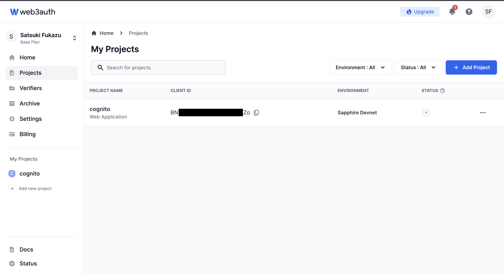
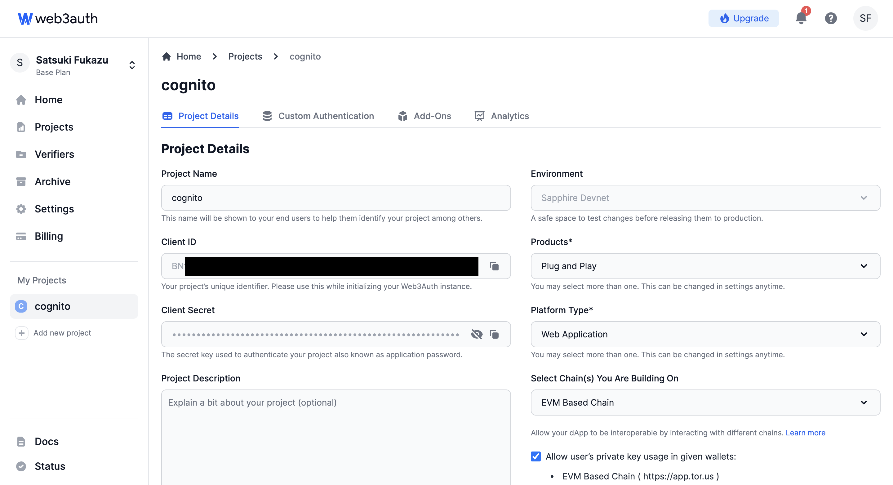
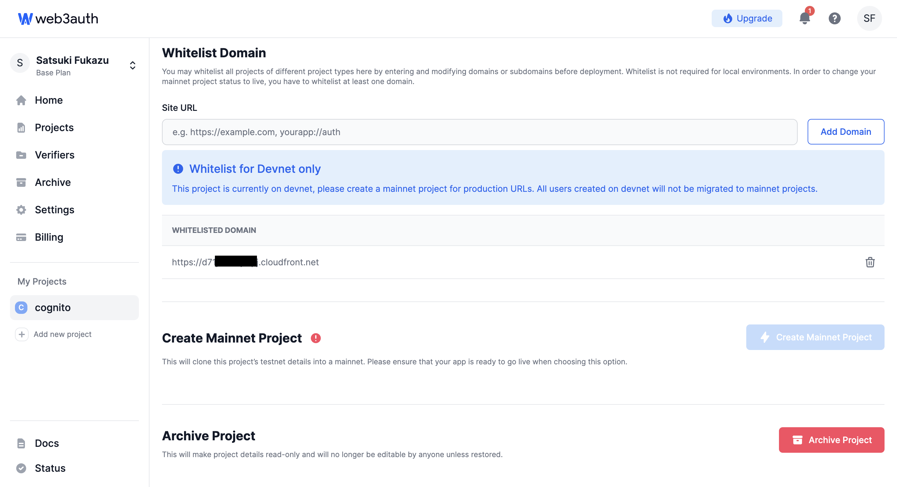
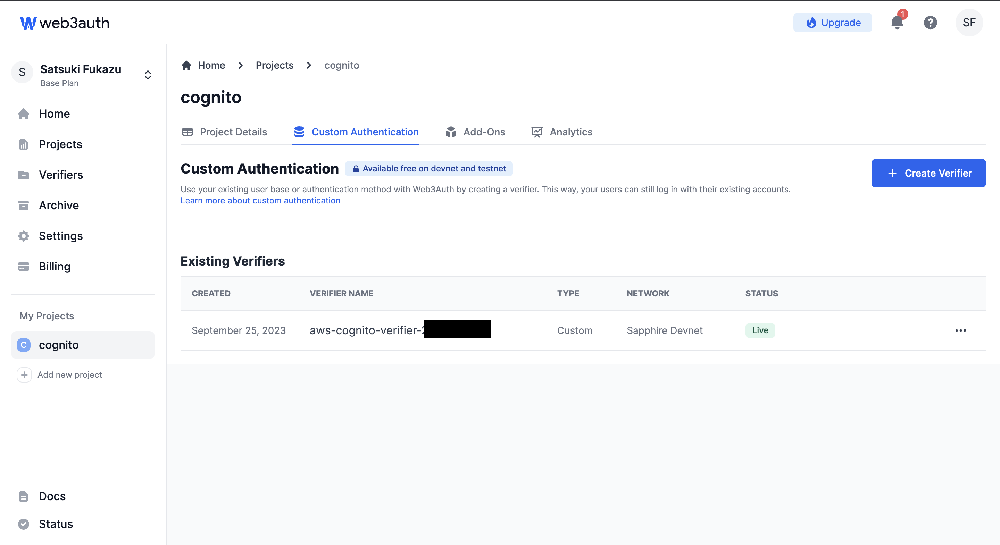

How To Deploy
===

## Prerequisites
- Execution Environment: AWS Cloud9 or Amazon Linux 2 environment within Amazon CodeCatalyst.
- Knowledge of AWS CDK and Docker.
- You already has obtained X (formerly Twitter) Consumer Key and Consumer Secrets.

## Generating Private Key for Validating JSON Web Tokens

- Generate an RSA Format Private Key
  ```
  $ cd cdk/lambda
  $ npm install
  $ openssl genrsa -out private_key_2048.pem
  ```

- Create JWK
  ```
  $ openssl rsa -pubout -in private_key_2048.pem | node_modules/pem-jwk/bin/pem-jwk.js > jwk.out
  ```

- Install JQ
  ```
  $ sudo yum install jq
  ```

- Set the Value of JWK's N in an Environment Variable
  ```
  $ jq .n jwk.out 
  "wAUKsA8R...."

  $ export JWK_N=wAUKsA8R....
  $ cd ../..
  ```

### Build Web Application for testing

- Download the sample web application. It can integrate with Web3Auth and Amazon Cognito.
  ```
  $ npx degit Web3Auth/web3auth-pnp-examples/web-no-modal-sdk/custom-authentication/single-verifier-examples/cognito-react-no-modal-example w3a-cognito-demo 
  $ cd w3a-cognito-demo
  $ npm install
  ```

- Build the sample web application
  ```
  $ npm run build
  $ cd ../
  ```

## Deploy to AWS Environment Part1

### Initializing the AWS CDK

> Execute the following command only if you are not using AWS CDK in the deployment region.

- Execute initialize the AWS CDK
  ```
  $ cd cdk
  $ npm install
  $ npx cdk bootstrap

  // AWS WAF for CloudFront can only be deployed to us-east-1 reagion. We need to execute the initialize command to us-east-1 region.
  $ npx cdk bootstrap <aws account id>/us-east-1
  ```

- Change cdk.json to set up the VPC sider
  ```
  $ vi cdk.json
  "VPC_CIDR": "172.16.1.0/16",
  ```

- Deploy VPC with AWS CDK
  ```
  $ npx cdk deploy WafStack
  $ npx cdk deploy RemoteOutput
  $ npx cdk deploy VPCStack
  ```

- Deploy frontend stack which include sample web application with AWS CDK
  ```
  $ npx cdk deploy FrontendStack

  FrontendStack.FrontendStackCloudFrontURL53065248 = https://abcdefghijklm.cloudfront.net/
  ```

- Deploy Amazon Cognito and Amazon API Gateway
  ```
  $ npx cdk deploy CognitoWithXStack

  CognitoWithXStack.CacheStackmemcachedEndpointAddressB93EAFBF = cog-ca-abcdefghijklm.nopqrs.cfg.usw2.cache.amazonaws.com
  CognitoWithXStack.CognitoStackXAuthProxyEndpoint242054AC = https://abcdefghij.execute-api.us-west-2.amazonaws.com/prod/
  CognitoWithXStack.CognitoStackXOathProxyUrl080D4A8C = https://abcdefghij.execute-api.us-west-2.amazonaws.com/prod/
  CognitoWithXStack.CognitoStackUserPoolClientId92EC2595 = abcdefghijklmnopqrstuwxyza
  CognitoWithXStack.CognitoStackUserPoolCloudFrontDomainName73A7719C = abcdefghijklm.cloudfront.net
  CognitoWithXStack.CognitoStackUserPoolDomainEndpoint6C8F67BB = https://111122223333-x-oauth-proxy.auth.us-west-2.amazoncognito.com
  CognitoWithXStack.CognitoStackUserPoolDomainName91D1E29E = 111122223333-x-oauth-proxy
  CognitoWithXStack.CognitoStackUserPoolId3E384F9B = us-west-2_abcdefghi
  ```

- Please note the `CognitoStackUserPoolId` and `CognitoStackUserPoolClientId`

## Obtain the credential of Web3Auth

### Create new project
- Access to the Web3Auth dashboard
  https://dashboard.web3auth.io

- Access to the `Project` from the left side.
- Click the `Add project` button


- Into the project name to the `Project name`
- Choose the `Plug and Play` at Select Product(s)
- Choose the `Web Application` at Platform Type(s)
- Choose the `Sapphire Devnet` at Environment
- Choose the `EVM Based Chain` at Select chain(s) you are building on
- Enable the checkbox on the `Allow user's private key usage in given wallets`
- Click the `Create Project` button


- Please make sure to take note of the `client id`

- Scroll to the bottom of the screen and enter your website's URL in the `Whitelist Domain` section.
- Click the `Add Domain` button


### Create Custom Authentication
- Select the `Custom Authentication` tab.
- Click the `Create Verifier` button


- Input the `Create Verifier` screen as follows:
  - Enter Verifier Identifier: {name of identifier}
  - Login Provider: Custom
  - JWT Verifier ID: Email
  - JWK Endpoint: https://cognito-idp.{region}.amazonaws.com/{CognitoStackUserPoolId}/.well-known/jwks.json
  - Select JWT Validation:
    - Field: iss
      Value: https://cognito-idp.{region}.amazonaws.com/{CognitoStackUserPoolId}`
    - Field: aud
      Value: {CognitoStackUserPoolClientId}


- Click the `Create` button
- Please wait until the creation is complete.


## Deploy to AWS Environment Part2
### Redeploy the Configuration with Complete Settings

- Modify the source code of the web application for operation confirmation
  ```
  $ vi w3a-cognito-demo/src/App.tsx 
  8 import { OpenloginAdapter } from "@web3auth/openlogin-adapter";
    import { TORUS_SAPPHIRE_NETWORK } from "@toruslabs/constants";  // Add

  15 const clientId = <Web3 Auth Client ID>
  ```
  ```
  $ vi w3a-cognito-demo/src/App.tsx

  46         const openloginAdapter = new OpenloginAdapter({
  47           privateKeyProvider,
  48           adapterSettings: {
  49             loginConfig: {
  50               jwt: {
  51                 verifier: <Web3Auth_Verifier_Identifier>,
  52                 typeOfLogin: "jwt",
  53                 clientId: <CognitoStackUserPoolClientId>
  54               },
  55             },
  56           },
  57         });
  ```
  ```
  $ vi w3a-cognito-demo/src/App.tsx

  36        const web3auth = new Web3AuthNoModal({
  37        clientId,
  38        web3AuthNetwork: WEB3AUTH_NETWORK.SAPPHIRE_DEVNET, // Chage SAPPHIRE_MAINNET to SAPPHIRE_DEVNET
  38        privateKeyProvider,
  39      });
  ```
  ```
  $ vi w3a-cognito-demo/src/App.tsx

  79     const web3authProvider = await web3auth.connectTo(
  80       WALLET_ADAPTERS.OPENLOGIN,
  81       {
  82         loginProvider: "jwt",
  83         extraLoginOptions: {
  84           domain: <CognitoStackUserPoolDomainEndpoint>,
  85           verifierIdField: "email",
  86           response_type: "token",
  87           scope: "email profile openid",
               user_info_route: 'oauth2/userInfo'  // In the case of Cognito, you should explicitly specify the userInfo path as it differs from the default value in Web3Auth.
  88         },
  89       } 
  90     ); 
  ```
  ```
  $ vi w3a-cognito-demo/src/App.tsx 
  
  112   const logout = async () => {
  113     if (!web3auth) {
  114       uiConsole("web3auth not initialized yet");
  115       return;
  116     }
  117     await web3auth.logout();
  118     setLoggedIn(false);
  119     setProvider(null);

          // Add to logout url
          const logoutUrl: string = `<CognitoStackUserPoolDomainEndpoint>/logout` + 
            `?client_id={CognitoStackUserPoolClientId}` + 
            `&logout_uri=${encodeURIComponent(window.location.origin)}/`  // The trailing '/' is important. Please be aware that its absence can result in an error.

            // redirect to logout page.
          window.location.replace(logoutUrl);
  120   };
  ```

- Build again the sample web application
  ```
  $ cd w3a-cognito-demo/
  $ npm run build
  ```

- Set the environment variables
  ```
  export X_CONSUMER_KEY=
  export X_CONSUMER_KEY_SECRET=
  ```
  

- Deploy again with AWS CDK.
  ```
  $ cd ../cdk
  $ npx cdk deploy FrontendStack

  Outputs:
  FrontendStack.FrontendStackCloudFrontURL53065248 = https://abcdefghijklm.cloudfront.net/
  ```
  ```
  $ npx cdk deploy CognitoWithXStack

  Outputs:
  CognitoWithXStack.CacheStackmemcachedEndpointAddressB93EAFBF = cog-ca-abcdefghijklm.nopqrs.cfg.usw2.cache.amazonaws.com
  CognitoWithXStack.CognitoStackXAuthProxyEndpoint242054AC = https://abcdefghij.execute-api.us-west-2.amazonaws.com/prod/
  CognitoWithXStack.CognitoStackXOathProxyUrl080D4A8C = https://abcdefghij.execute-api.us-west-2.amazonaws.com/prod/
  CognitoWithXStack.CognitoStackUserPoolClientId92EC2595 = abcdefghijklmnopqrstuwxyza
  CognitoWithXStack.CognitoStackUserPoolCloudFrontDomainName73A7719C = abcdefghijklm.cloudfront.net
  CognitoWithXStack.CognitoStackUserPoolDomainEndpoint6C8F67BB = https://111122223333-x-oauth-proxy.auth.us-west-2.amazoncognito.com
  CognitoWithXStack.CognitoStackUserPoolDomainName91D1E29E = 111122223333-x-oauth-proxy
  CognitoWithXStack.CognitoStackUserPoolId3E384F9B = us-west-2_abcdefghi
  ```

- You can see the URL of Demo Application. Access to the `FrontendStack.FrontendStackCloudFrontURL` in output of CDK.

- Activate the X login link function for Cognito's userPool by manual operation
  - Open the AWS Management Console and open the Cognito screen 
  
  - Open the UserPool created in CDK and open the `App Integration` tab 
  
  - Scroll through the screen and press the name displayed in the `App clients and analytics`
  
  - Click the edit button on the `hosted UI`
  - Add `OIDCProviderX` to your `identity provider`
  
  - Press the `Save Changes` button