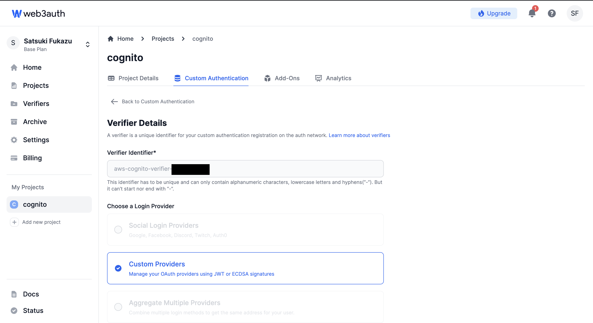
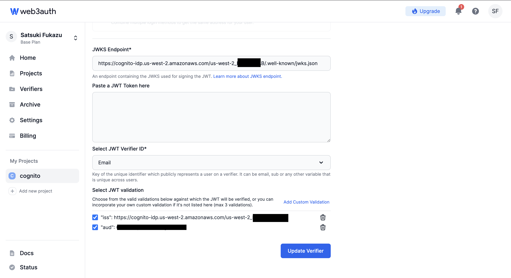
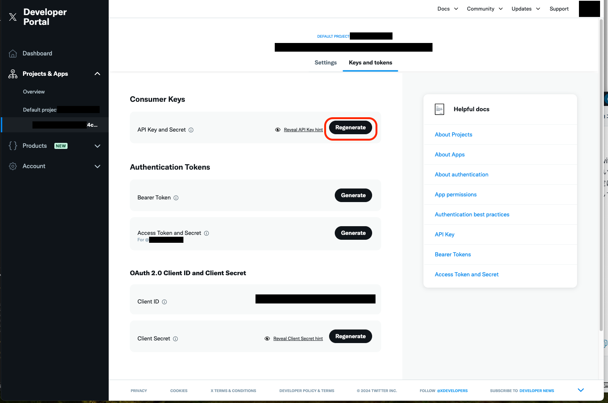
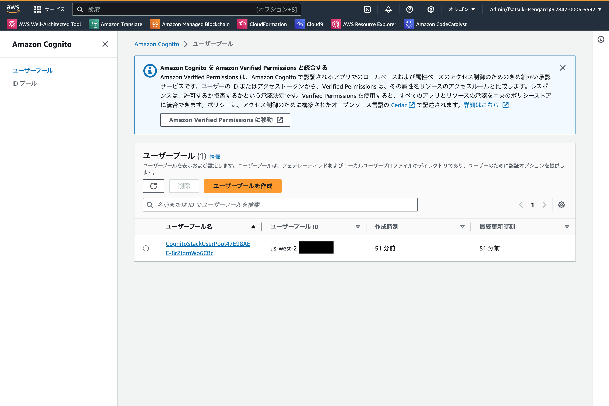
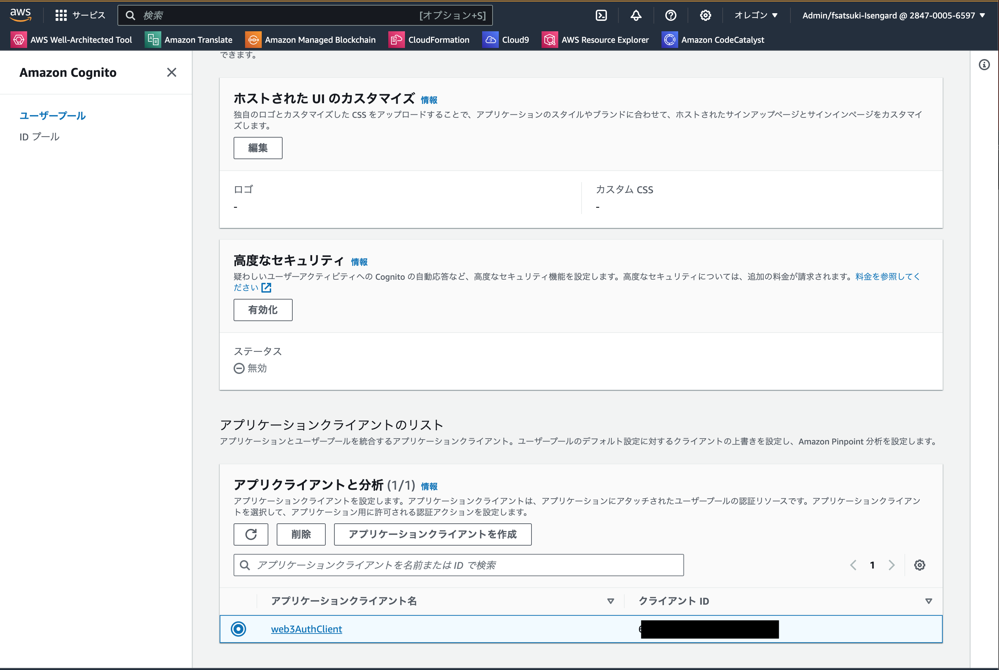
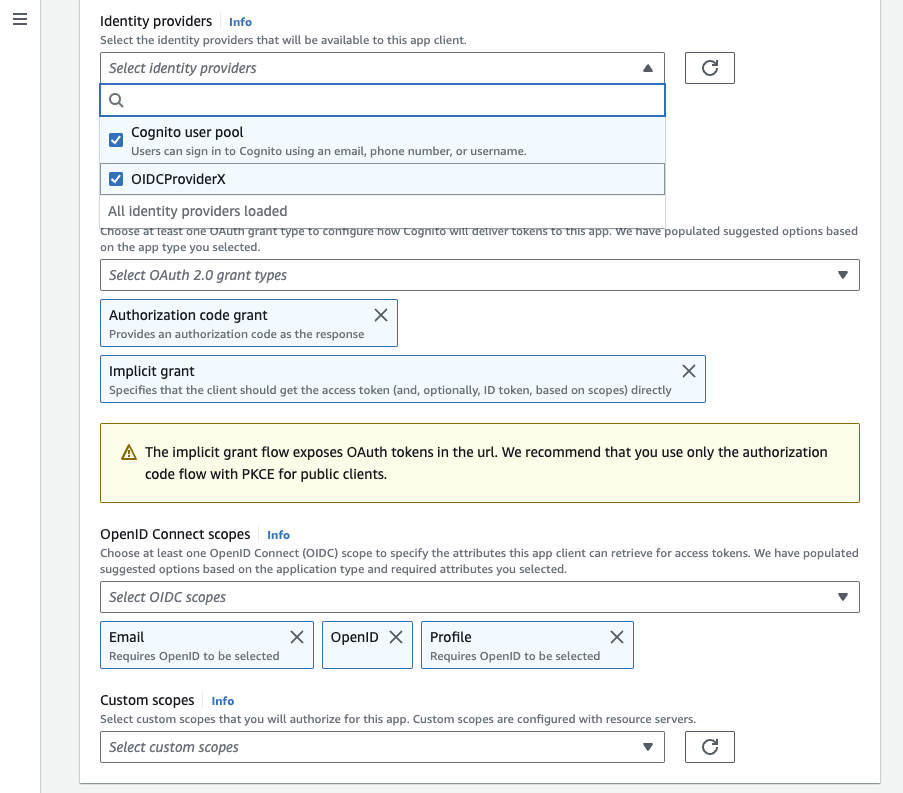

環境構築
===

## 前提条件
- 実施環境: AWS Cloud9もしくはAmazon CodeCatalystのAmazon Linux2環境
- AWS CDK, Dockerに関する知識があること
- X(旧Twitter)のConsumer Key, Consumer Secretsを取得済みであること。

## JSON Web Tokenの有効性を検証するときに使用する秘密鍵の生成

- RSA形式の秘密鍵を生成する
  ```
  $ cd cdk/lambda
  $ npm install
  $ openssl genrsa -out private_key_2048.pem
  ```

- JWKの生成
```
$ openssl rsa -pubout -in private_key_2048.pem | node_modules/pem-jwk/bin/pem-jwk.js > jwk.out
```

- JQのインストール
```
$ sudo yum install jq
```

- 環境変数にJWKのNの値を設定
```
$ jq .n jwk.out 
"wAUKsA8R...."

$ export JWK_N=wAUKsA8R....
```

- 元のディレクトリに戻る
```
$ cd ../..
```

### 動作確認用のWebアプリケーションのビルド

- Web3AuthとCognitoを連携させるサンプルWebアプリケーションをダウンロードする
  ```
  $ npx degit Web3Auth/web3auth-pnp-examples/web-no-modal-sdk/custom-authentication/single-verifier-examples/cognito-no-modal-example w3a-cognito-demo 
  $ cd w3a-cognito-demo
  $ npm install

- サンプルWebアプリケーションをビルドする
  ```
  $ npm run build
  $ cd ../
  ```

## AWS環境構築 Part1

### AWS CDKの初期設定

> 下記のコマンドはデプロイを実施するリージョンでAWS CDKを使用していない場合のみ実施する

- CDKの初期設定を実施する
```
$ cd cdk
$ npm install
$ npx cdk bootstrap

// CloudFront用のWAFはus-east-1にしか建てられないため、us-east-1でもbootstrapする
$ npx cdk bootstrap <aws account id>/us-east-1
```

- VPCのCidrを設定ファイルで定義する
  ```
  $ vi cdk.json
  "VPC_CIDR": "172.16.1.0/16",
  ```

- CDKを使用してVPCをデプロイする
  ```
  $ npx cdk deploy WafStack
  $ npx cdk deploy RemoteOutput
  $ npx cdk deploy VPCStack
  ```

- CDKを使用して動作確認用のフロントエンドをデプロイする
  ```
  $ npx cdk deploy FrontendStack

  FrontendStack.FrontendStackCloudFrontURL53065248 = https://abcdefghijklm.cloudfront.net/
  ```

- Amazon CognitoとAmazon API Gatewayをデプロイする.
  ```
  $ npx cdk deploy CognitoWithXStack

  CognitoWithXStack.CacheStackmemcachedEndpointAddressB93EAFBF = cog-ca-abcdefghijklm.nopqrs.cfg.usw2.cache.amazonaws.com
  CognitoWithXStack.CognitoStackXAuthProxyEndpoint242054AC = https://abcdefghij.execute-api.us-west-2.amazonaws.com/prod/
  CognitoWithXStack.CognitoStackXOathProxyUrl080D4A8C = https://abcdefghij.execute-api.us-west-2.amazonaws.com/prod/
  CognitoWithXStack.CognitoStackUserPoolClientId92EC2595 = abcdefghijklmnopqrstuwxyza
  CognitoWithXStack.CognitoStackUserPoolCloudFrontDomainName73A7719C = abcdefghijklm.cloudfront.net
  CognitoWithXStack.CognitoStackUserPoolDomainEndpoint6C8F67BB = https://111122223333-x-oauth-proxy.auth.us-west-2.amazoncognito.com
  CognitoWithXStack.CognitoStackUserPoolDomainName91D1E29E = 111122223333-x-oauth-proxy
  CognitoWithXStack.CognitoStackUserPoolId3E384F9B = us-west-2_abcdefghi
  ```

- CognitoStackUserPoolIdをメモする
- CognitoStackUserPoolClientIdをメモする

## Web3Authの認証情報を取得

### プロジェクトの作成
- Web3Auth開発者ダッシュボードにアクセスする  
  https://dashboard.web3auth.io

- 左のMENUより`Project` を選択
- `Add project` ボタンを押下する


- Project name欄に任意の文字列を入力する
- Select Product(s)に`Plug and Play`を選択する
- Platform Type(s)に`Web Application`を選択する
- Environmentに`Sapphire Devnet`を選択する
- Select chain(s) you are building onに`EVM Based Chain`を選択する
- `Allow user's private key usage in given wallets` にチェックをつける
- `Create Project` ボタンを押下する


- 詳細画面が表示されるので、`client id` を **必ずメモをすること**

- 画面下部にスクロールし、`Whitelist Domain`にWebサイトのURLを入力する。 
- `Add Domain`ボタンを押下する


### Custom Authentication を作成する
- `Custom Authentication`のタブを選択する
- `Create Verifier` ボタンを押下する


- Create Verifierの画面は以下の通りに入力する
  - Enter Verifier Identifier: <任意の文字列>
  - Login Provider: Custom
  - JWT Verifier ID: Email
  - JWK Endpoint: https://cognito-idp.{region}.amazonaws.com/{CognitoStackUserPoolId}/.well-known/jwks.json
  - Select JWT Validation:
    - Field: iss
      Value: https://cognito-idp.{region}.amazonaws.com/{CognitoStackUserPoolId}`
    - Field: aud
      Value: {CognitoStackUserPoolClientId}




- `Create` ボタンを押下する
- 作成完了まで10分ほど待つ。

## AWS環境構築 Part2
### 設定値を完全な状態で再度デプロイする

- 動作確認用のWebアプリケーションのソースコードを修正する
  ```
  $ vi w3a-cognito-demo/src/App.tsx 
  8 import { OpenloginAdapter } from "@web3auth/openlogin-adapter";
    import { TORUS_SAPPHIRE_NETWORK } from "@toruslabs/constants";  // 追記

  15 const clientId = <Web3 Auth Client ID>
  ```
  ```
  $ vi w3a-cognito-demo/src/App.tsx

  46         const openloginAdapter = new OpenloginAdapter({
  47           privateKeyProvider,
  48           adapterSettings: {
  49             loginConfig: {
  50               jwt: {
  51                 verifier: <Web3Auth_Verifier_Identifier>,
  52                 typeOfLogin: "jwt",
  53                 clientId: <CognitoStackUserPoolClientId>
  54               },
  55             },
  56           },
  57         });
  ```
  ```
  $ vi w3a-cognito-demo/src/App.tsx

  36        const web3auth = new Web3AuthNoModal({
  37        clientId,
  38        web3AuthNetwork: WEB3AUTH_NETWORK.SAPPHIRE_DEVNET, // SAPPHIRE_MAINNETからSAPPHIRE_DEVNETに変更する
  38        privateKeyProvider,
  39      });
  ```
  ```
  $ vi w3a-cognito-demo/src/App.tsx

  79     const web3authProvider = await web3auth.connectTo(
  80       WALLET_ADAPTERS.OPENLOGIN,
  81       {
  82         loginProvider: "jwt",
  83         extraLoginOptions: {
  84           domain: <CognitoStackUserPoolDomainEndpoint>,
  85           verifierIdField: "email",
  86           response_type: "token",
  87           scope: "email profile openid",
               user_info_route: 'oauth2/userInfo'  // Cognitoの場合、userInfoのパスが  web3Authのデフォルト値と異なるので、明示的に指定すること
  88         },
  89       } 
  90     ); 
  ```
  ```
  $ vi w3a-cognito-demo/src/App.tsx 

  112   const logout = async () => {
  113     if (!web3auth) {
  114       uiConsole("web3auth not initialized yet");
  115       return;
  116     }
  117     await web3auth.logout();
  118     setLoggedIn(false);
  119     setProvider(null);

          // ログアウト用のリンクを追記
          const logoutUrl: string = `<CognitoStackUserPoolDomainEndpoint>/logout` + 
            `?client_id={CognitoStackUserPoolClientId}` + 
            `&logout_uri=${encodeURIComponent(window.location.origin)}/`  // 末尾の'/'が大事。無いとエラーになるので注意

            // ログアウトページに遷移.
          window.location.replace(logoutUrl);
  120   };
  ```

- WebAppをビルド
  ```
  $ cd w3a-cognito-demo/
  $ npm run build
  ```

- 環境変数を設定する
  ```
  export X_CONSUMER_KEY=XXXX
  export X_CONSUMER_KEY_SECRET=xxxxxaaaaasssss
  ```
  

- CDKを使って再度デプロイ
  ```
  $ cd ../cdk
  $ npx cdk deploy FrontendStack

  Outputs:
  FrontendStack.FrontendStackCloudFrontURL53065248 = https://abcdefghijklm.cloudfront.net/
  ```
  ```
  $ npx cdk deploy CognitoWithXStack

  Outputs:
  CognitoWithXStack.CacheStackmemcachedEndpointAddressB93EAFBF = cog-ca-abcdefghijklm.nopqrs.cfg.usw2.cache.amazonaws.com
  CognitoWithXStack.CognitoStackXAuthProxyEndpoint242054AC = https://abcdefghij.execute-api.us-west-2.amazonaws.com/prod/
  CognitoWithXStack.CognitoStackXOathProxyUrl080D4A8C = https://abcdefghij.execute-api.us-west-2.amazonaws.com/prod/
  CognitoWithXStack.CognitoStackUserPoolClientId92EC2595 = abcdefghijklmnopqrstuwxyza
  CognitoWithXStack.CognitoStackUserPoolCloudFrontDomainName73A7719C = abcdefghijklm.cloudfront.net
  CognitoWithXStack.CognitoStackUserPoolDomainEndpoint6C8F67BB = https://111122223333-x-oauth-proxy.auth.us-west-2.amazoncognito.com
  CognitoWithXStack.CognitoStackUserPoolDomainName91D1E29E = 111122223333-x-oauth-proxy
  CognitoWithXStack.CognitoStackUserPoolId3E384F9B = us-west-2_abcdefghi
  ```

- CDKのOutputに出力された `FrontendStack.FrontendStackCloudFrontURL` にアクセス.

- 手動による操作で、CognitoのuserPoolにXのログイン連携機能を有効にする
  - AWSのマネジメントコンソールを開き、Cognitoの画面を開く 
  
  - CDKで作成したuserpoolを開き、 `アプリケーションの統合`` のタブを開く 
  
  - 画面をスクロールし、 `アプリクライアントと分析` の `アプリケーションとクライアント名`` に表示されている名前を押下する 
  
  - ホストされた UI の `編集` ボタンを押下する
  - ID プロバイダー に `OIDCProviderX` を追加する 
  
  - 変更を保存 ボタンを押下する